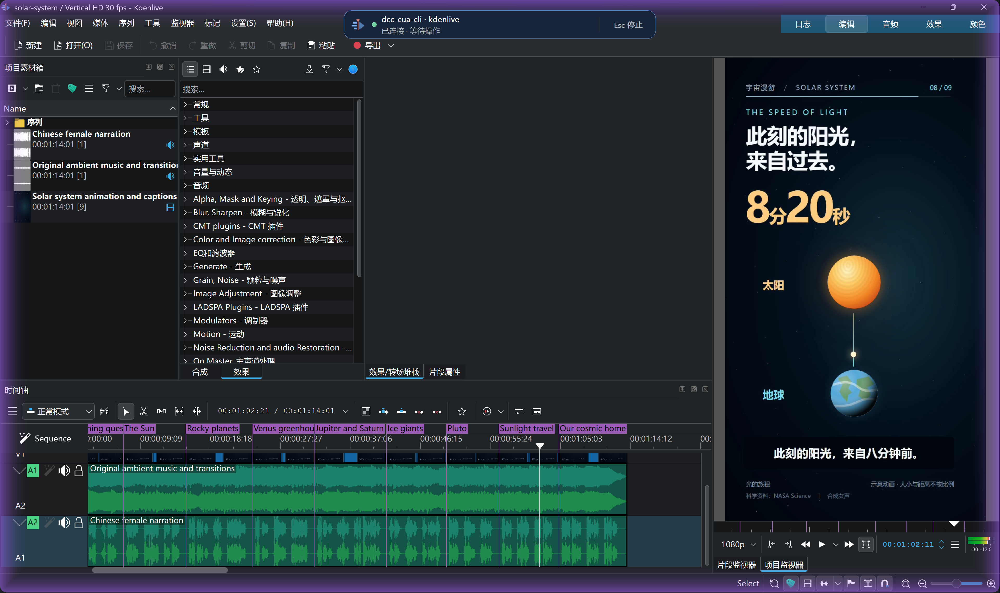

# Showcase sources

## ImageGen interface reconstruction: a headphone product-video edit

- [Generated source PNG](kdenlive-headphones-workflow.png): 1672 × 941 pixels, 1,627,554 bytes; exact copy of the selected built-in ImageGen output.
- [README WebP](../images/headphones-workflow-showcase.webp): same dimensions, 161,720 bytes; encoded at quality 90 with no crop or visual retouching.
- Source SHA-256: `c62c33089b8ce99143e2e21f193affd124c93636c62e538c142b6771f0f03560`.
- WebP SHA-256: `3d17a0fec8bc3e1365901e366c61775da27bb1f801ccd1e407943ec078b8541f`.
- [Complete prompts, reference chain and asset provenance](imagegen-provenance.json).

This is an **ImageGen interface reconstruction and workflow illustration**,
created on 2026-09-14. It depicts a headphone product-video edit with source
clips, a timeline, narration/music tracks and a portrait preview. It is not a
live recording, a captured application state, a permission receipt, an audit
record, or evidence that an operation or export completed.

### References and attribution

The Kdenlive layout comes from the project-owner screenshot preserved below.
ImageGen replaced its Solar System content with the headphone project, removed
the floating connection HUD and rebalanced panels for landscape framing.

The headphone design was first generated using an interface reference from the
**Blender Documentation Team, Blender Manual**,
[Window System Introduction](https://docs.blender.org/manual/en/latest/interface/window_system/introduction.html).
The [original reference image](https://docs.blender.org/manual/en/latest/_images/interface_window-system_introduction_default-screen.png)
is supplied under [CC BY-SA 4.0](https://creativecommons.org/licenses/by-sa/4.0/),
as described in the [Blender Manual copyright notice](https://docs.blender.org/manual/en/latest/copyright.html).
ImageGen reconstructed neutral dark interface colours and replaced the cube
with an original headphone illustration; this Kdenlive image reuses that
generated headphone identity. The reference-derived PNG and WebP illustrations
in this section are also provided under CC BY-SA 4.0. Application marks and
third-party trademarks remain their owners' property and imply no endorsement.

## Kdenlive solar-system project

- File: [`kdenlive-solar-system.png`](kdenlive-solar-system.png)
- Source: screenshot supplied by the project owner on 2026-09-14 for this public showcase.
- Dimensions: 3841 × 2281 pixels.
- Size: 1,427,788 bytes.
- SHA-256: `e16173506107d1742603facea3e180842ce7b819f2239ad4e92e4052ebe0dbb1`.
- Processing: exact copy of the supplied PNG; no cropping, retouching, or generated UI.

The screenshot shows the existing `solar-system` project in Kdenlive using the
Vertical HD 30 fps profile. Visible elements include scene markers, the vertical
project preview, an ambient music track, a Chinese female narration track, and
the DCC-CUA connected-state banner.

This is a still of the editor state. The control indicator is not evidence that
a particular input ran or an export completed. The screenshot is separate from
the bilingual DCC-MCP introduction video.
